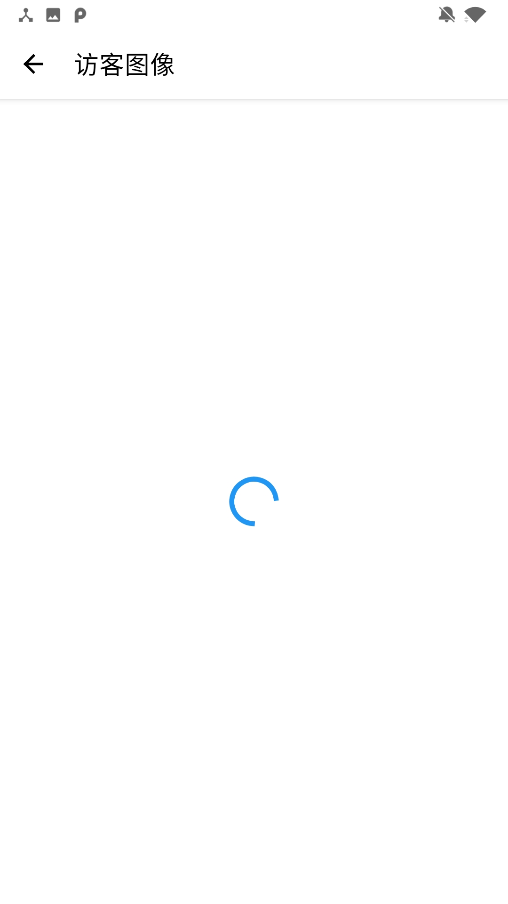

# Android 综合课程设计 - 局域网家庭监视器

本项目为 Android 综合课程设计中的 Android 应用端部分，需要配套相关的物联网设备才能运行相关功能。本课程设计构建了一个简单的TCP协议，用于识别物联网设备传输的数据、命令以及二进制数据，使用 UDP 监听局域网中的物联网设配（通过识别特定的识别符进行设备判断）。本软件已拥有软著，借鉴请说明源处。

# 项目概述

本系统使用拥有简明舒适的UI设计，使用Material Design 设计语言开发。通过与配套的硬件设备通信，能够针对该硬件进行数据的显示，相关设备的控制，访客提醒等功能，采集到的数据会保存至本机，若登录账户后，则可将数据同步到云端避免丢失。通过本系统，用户可以查看到访客图像，液化气指数超过阈值警告，该硬件所在环境的温度，湿度等信息，能进行门窗控制等。

# 运行环境

Android 8.0 及以上系统版本，该系统所搭载的设备支持WLAN 功能。

# 使用说明

## 登录

 如图1.1、图1.2所示是该客户端的登录和注册界面，用户在图1.2所示的注册页面进行注册后，才能在图一所示的登录界面进行登录，若未注册或账号已被注册会有相关提醒。

## 首页
  
图1.3、1.4 为应用的首页界面，进入首页后，本系统会自动开启端口监听检测该系统配套的硬件，如果检查到设备，则会在首页进行显示。若扫描不到，用户还可通过右下角的悬浮按钮打开手动添加设备对话框，输入设备名和设备在局域网的IP 即可连接设备进行使用。点击设备卡片，可进入设备详情页面。

## 设备详情

如图 1.5、1.6、1.7、1.8 所示为设备详情页，该页面可显示所连接的设备的相关采集数据，以及可以对该设备进行控制，如开关门，调节风扇和窗户，可以看到收集到的温度数据等的变化。

  

## 导航栏
         
通过首页的左上角的汉堡菜单，可进入该导航栏，用户登陆前，导航栏显示如图1.9，用户登录后，导航栏显示如图1.10。导航栏主要的功能有 导航至用户登录/注册/设置界面，以及显示用户名和退出登录操作。

## 设置
     
如图1.11、1.12所示，在设置页面可以检查该系统的新版本，查看该系统的开发人员以及控制访客提醒的开关和数据同步的设置

## 通知

当系统与相关硬件连接时，收到新访客的数据，则如图1.13所示会弹出通知提醒用户有新访客，点击该通知可以显示访客照面，当系统检测到液化气指数超过阈值时，也会发出一条通知提醒用户，如图1.14 所示。
  

## 访客图像

当用户点击查看访客图像后，该系统会进入如图1.15所示界面，并在访客图像加载完成前显示加载动画，当图像加载完成后，显示如图1.16所示，该画面未访客按下门铃时所截取的（涉及隐私，该文档里此图已做马赛克处理）
    

